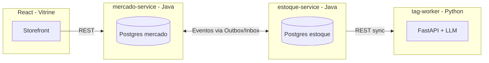
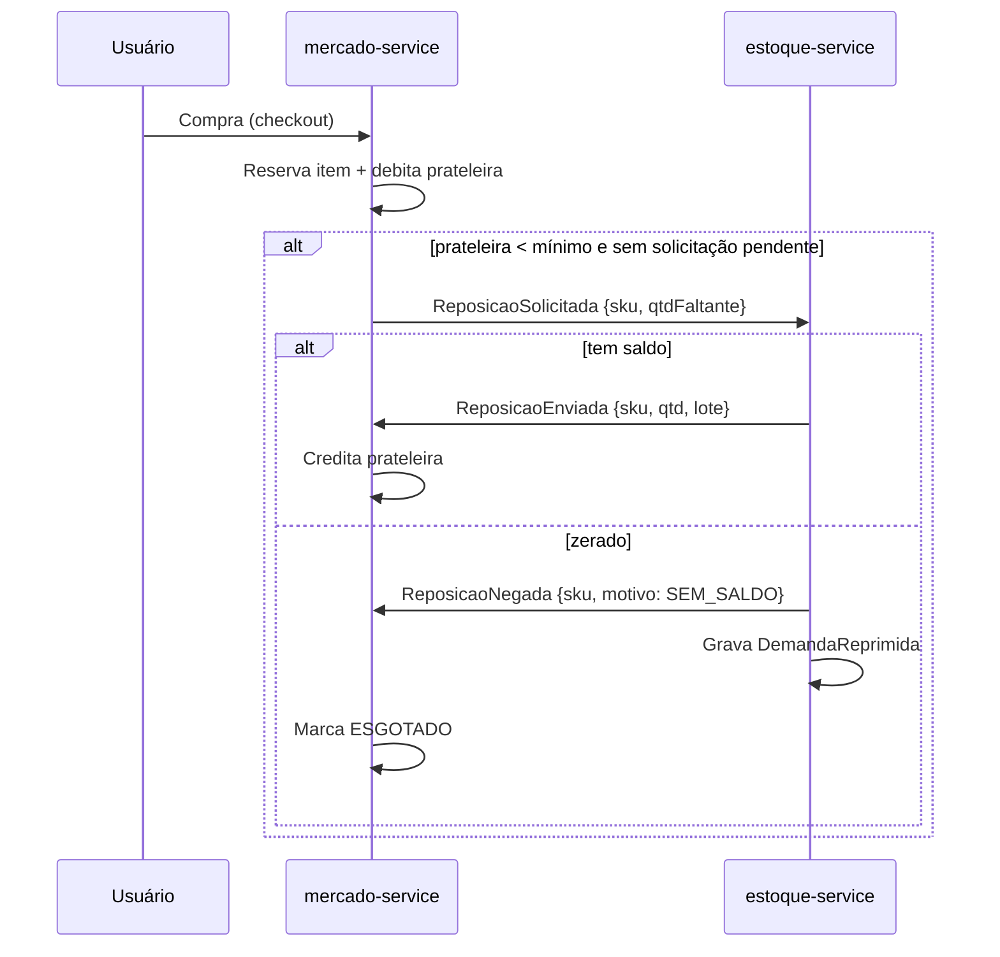

# Estoque 2.0 — Arquitetura

Sistema de reposição automática entre um **mercado virtual** e um **estoque (almoxarifado)**, construído como dois serviços independentes que se comunicam por eventos. Projeto de portfólio com foco em engenharia backend de qualidade de produção.

---

## 1. Visão geral

Dois sistemas separados, cada um com seu banco, conversando por **Transactional Outbox** sobre PostgreSQL — sem broker externo. Um worker Python isolado cuida da classificação de tags com LLM, sempre fora do caminho crítico da venda.



**Princípio central:** o núcleo de reposição é **determinístico e auditável**. LLM só aparece na periferia (classificar tags, resumir demanda). Nada de IA decidindo quantidade de reposição.

---

## 2. Componentes

| Componente | Linguagem | Papel |
|---|---|---|
| `mercado-service` | Java 25 + Spring Boot 4 | Vitrine, vendas, reserva de estoque, gatilho de reposição |
| `estoque-service` | Java 25 + Spring Boot 4 | Saldo, lotes, transferências, demanda reprimida |
| `tag-worker` | Python 3.12 + FastAPI | Classificação de tags/categoria via LLM (REST síncrono) |
| `vitrine-web` | React + Vite | Front do mercado |
| Admin estoque | Thymeleaf + HTMX | Painel operacional (entrada de lote, saldo) — sem SPA |

**Bancos:** dois PostgreSQL 17 separados, um por serviço. Sem FK cruzada entre bancos — o **SKU/EAN** é a identidade canônica compartilhada.

---

## 3. Fluxo de reposição (min/max)

Reposição dispara no **ponto de reposição**, não a cada venda. A prateleira tem `estoque_minimo` (gatilho) e `estoque_ideal` (alvo).



**Regra de gatilho** (no mercado, após debitar):

```
se (estoquePrateleira < estoqueMinimo && !temSolicitacaoPendente(sku)):
    publicar ReposicaoSolicitada(sku, estoqueIdeal - estoquePrateleira)
```

Pede um lote só (diferença até o ideal), nunca uma unidade por venda.

**Reposição por entrada de lote:** quando o estoque recebe um lote novo, além de classificar tags via worker, ele varre a `DemandaReprimida` daquele SKU e dispara a reposição sozinho — sem ninguém precisar lembrar.

---

## 4. Casos de borda

| Caso | Tratamento |
|---|---|
| Estoque zerado | `ReposicaoNegada` → mercado marca `ESGOTADO` + estoque grava `DemandaReprimida` |
| Entrada de lote novo | Classifica tags + atende demanda reprimida automaticamente |
| Overselling | Reserva no **checkout**, não na confirmação do pagamento |
| Duplicata de evento | `InboxEvent` checado antes de processar (idempotência) |
| Worker de tags fora do ar | Produto salvo **sem** tags; reprocessa depois. Venda nunca depende disso |

---

## 5. Contratos de evento (records)

Duplicados nos dois serviços — mantém independência real entre eles.

```java
public record ReposicaoSolicitada(
    UUID eventId, String sku, int qtdFaltante, Instant ocorridoEm) {}

public record ReposicaoEnviada(
    UUID eventId, UUID correlationId, String sku,
    int qtd, String lote, Instant ocorridoEm) {}

public record ReposicaoNegada(
    UUID eventId, UUID correlationId, String sku,
    String motivo, Instant ocorridoEm) {}   // SEM_SALDO, SKU_DESCONHECIDO

public record ProdutoClassificado(
    UUID eventId, String sku, List<String> tags,
    String categoria, Instant ocorridoEm) {} // estoque → mercado; só posicionamento
```

Os quatro implementam a interface selada `EventoIntegracao` (`eventId()`, `ocorridoEm()`). `ProdutoClassificado` é publicado pelo estoque na mesma transação que grava as tags; o mercado só aplica uma classificação mais nova que a atual (`classificado_em`), porque eventos podem chegar fora de ordem.

---

## 6. Modelo de dados

### estoque-service

```java
ProdutoEstoque   { sku (PK, EAN), descricao, ncm, tags (JSON), saldoDisponivel }
Lote             { id, sku, codigoLote, quantidade, validade, recebidoEm }
DemandaReprimida { id, sku, qtdSolicitada, solicitacaoOriginal (UUID), atendida, registradoEm }
```

### mercado-service

```java
ProdutoVitrine { sku (PK, EAN), nome, tags (JSON),
                 estoquePrateleira, estoqueMinimo, estoqueIdeal, status }  // DISPONIVEL, ESGOTADO
Reserva        { id, sku, qtd, pedidoId (UUID), expiraEm, status }         // ATIVA, CONFIRMADA, EXPIRADA
Pedido         { id, ... }        // CRUD padrão
ItemPedido     { id, pedidoId, sku, qtd, precoUnitario }
```

### Outbox / Inbox (nos dois serviços)

```java
OutboxEvent { id, tipo, payload (JSON), status, criadoEm }   // PENDING, SENT
InboxEvent  { eventId (PK, UUID), processadoEm }
```

---

## 7. Transactional Outbox

Garante que **venda e evento de reposição nunca saem dessincronizados**, sem broker.

1. Na **mesma transação** que debita a prateleira, grava linha em `OutboxEvent` (status `PENDING`).
2. Job `@Scheduled` faz `SELECT ... FROM outbox_event WHERE status='PENDING' FOR UPDATE SKIP LOCKED LIMIT 50`.
3. Publica pro outro serviço (REST), marca `SENT`.
4. Consumidor checa `InboxEvent` antes de processar — protege da duplicata.

Virtual threads do Java 25 deixam o polling barato.

> **Alternativa:** Spring Modulith Event Publication Registry entrega o outbox pronto e reprocessa no restart. Para o portfólio, o outbox manual pesa mais (mostra o padrão explícito). Decisão em aberto.

---

## 8. Fronteira do Python (tag-worker)

REST síncrono, fora do caminho crítico:

```
POST /classificar   { "sku": "789...", "descricao": "COCA COLA 2L PET" }
→ 200  { "tags": ["bebida", "refrigerante", "2l"], "categoria": "bebidas" }
```

FastAPI + Pydantic. O estoque chama na entrada de lote. Timeout curto; falha = salva sem tags e segue.

---

## 9. Stack e ferramentas

- **Java 25 + Spring Boot 4** — dois serviços
- **PostgreSQL 17** — um banco por serviço
- **Flyway** — migrations
- **Records + Bean Validation** — contratos de evento imutáveis
- **JUnit 5 + Testcontainers** — Postgres real nos testes
- **Python 3.12 + FastAPI + Pydantic** — worker de tags
- **React + Vite** — vitrine
- **Thymeleaf + HTMX** — admin do estoque
- **Docker Compose** — orquestração local

---

## 10. Estrutura de repositório (sugerida)

```
estoque-2.0/
├── estoque-service/        # Java + Spring Boot
│   ├── src/main/java/.../{domain,application,infra,web}
│   ├── src/main/resources/db/migration/   # Flyway
│   └── pom.xml
├── mercado-service/        # Java + Spring Boot
│   └── ...
├── tag-worker/             # Python + FastAPI
│   ├── app/
│   └── pyproject.toml
├── vitrine-web/            # React + Vite
├── docker-compose.yml
└── ARCHITECTURE.md
```

---

## 11. Ordem de construção

1. `estoque-service`: entidades JPA + migrations Flyway + outbox/inbox
2. `mercado-service`: entidades + gatilho de reposição + consumer
3. Contratos de evento e o par publisher/consumer com Testcontainers
4. `tag-worker` FastAPI + integração na entrada de lote
5. `vitrine-web` React consumindo o mercado
6. Admin HTMX do estoque
7. Docker Compose amarrando tudo
